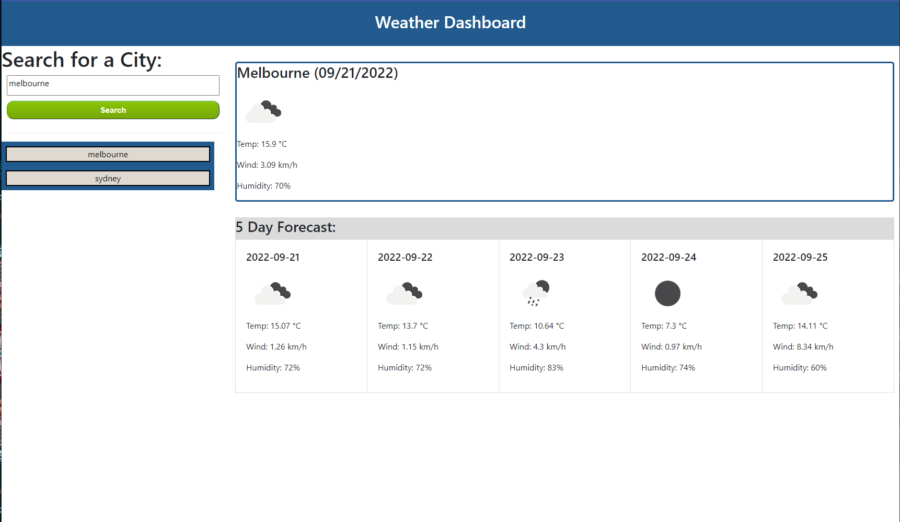

# Weather-Dashboard

## The Task

This webpage is to display a weather dashboard that will run in the browser and feature dynamically updated HTML and CSS.

I used the [5 Day Weather Forecast](https://openweathermap.org/forecast5) to retrieve weather data for cities, and used `localStorage` to store city names.
## User Story

```
AS A traveler
I WANT to see the weather outlook for multiple cities
SO THAT I can plan a trip accordingly
```
## Mock-Up

The following image shows the web application's appearance and functionality:



- - -
© 2022 Trilogy Education Services, LLC, a 2U, Inc. brand. Confidential and Proprietary. All Rights Reserved.
